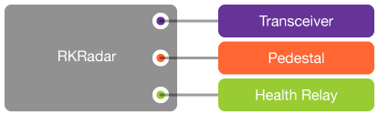

# RadarKit

First of all, many thanks for your interest in the framework! :smile: :thumbsup: :punch:

The RadarKit framework is a straight C framework. This is a library toolkit that abstracts various components of a radar signal processor. Mainly, the real-time operations of data collection, data fusion, transportation through network, and rudimentary processing from raw I/Q data to _base moment_ products. The main goal is to let developers only worry about implementing the interface between a _digital transceiver_, a _pedestal_, and a generic _health relay_. The RadarKit framework combines all of these information, generates radar products, provides live data and display streams, and redirects the control commands to the hardware.

## System Requirements

- Processors capable of SSE, SSE2, SSE3
- Optional: AVX, AVX-256, AVX-512

## Getting the Project

Follow these steps to get the project

1. Clone a git project using one of the following commands in Terminal:

   ```shell
   git clone https://github.com/ouradar/radarkit.git
   ```

   or

   ```shell
   git clone https://git.arrc.ou.edu/radar/radarkit.git
   ```

2. Get the required packages, which can either be installed through one of the package managers or compiled from source, which I would recommend for the FFTW library since it can take advantage of SSE, SSE2, AVX and AVX-2 accelerations (see 5).

   - [FFTW]
   - [NetCDF]
   - [OpenSSL]

   ##### Debian / Ubuntu

   ```shell
   apt-get install libfftw3-dev libnetcdf-dev
   ```

   ##### CentOS 7

   ```shell
   yum install epel-release
   yum install fftw-devel netcdf-devel
   ```

   ##### macOS

   I use [Homebrew] as my package manager for macOS. I highly recommend it.

   ```shell
   brew install fftw netcdf
   ```

   or

   ```shell
   brew install netcdf
   ```

   ##### Special Notes About NetCDF shared library

   Some operating systems require the following line in your shell profile for the netcdf shared library to be found.

   ```shell
   export LD_LIBRARY_PATH=/usr/local/lib
   ```

3. Compile and install the framework.

   ```shell
   make
   sudo make install
   ```

4. Try the test program to simulate a Level-1 system.

   ```shell
   rkutil -vs1
   ```

5. (Some Linux) Add the following line to /etc/sysctl.conf

   (CentOS 7)

   ```
   net.ipv4.ping_group_range = 0 0
   ```

   or

   (CentOS 6 / Ubuntu 18)

   ```
   net.ipv4.ping_group_range = 0 2147483647
   ```

6. (Optional) Compile [FFTW] from source

   ```shell
   ./configure --enable-single --enable-sse --enable-sse2 --enable-avx --enable-avx2 --enable-shared
   make
   sudo make install
   ```

[fftw]: http://www.fftw.org
[netcdf]: http://www.unidata.ucar.edu/software/netcdf
[homebrew]: http://brew.sh

## Basic Usage on a Radar Host

1. Initialize an `RKRadar` object (although RadarKit is not an objective implementation but it is easier to think this way). Supply the necessary _tranceiver_ routines and _pedestal_ routines. The _health relay_ is omitted here for simplicity.

   ```c
   #include <RadarKit.h>

   int main() {
       RKRadar *radar = RKInit();
       RKSetTransceiver(radar, userInput, transceiverInit, transceiverExec, transceiverFree);
       RKSetPedestal(radar, userInput, pedestalInit, pedestalExec, pedestalFree);
       RKGoLive(radar);
       RKWaitWhileActive(radar);
       RKFree(radar);
   }
   ```

2. By design, the data acquired through hardware, e.g., I/Q samples, is delivered to the RadarKit framework through functions provided in `<RadarKit/RKRadar.h>`, and a small number of functions in `<RadarKit/RKFoundation.h>` and `<RadarKit/RKMisc.h>`. The functions listed under these headers are about the only functions you should be concerned with. The design is intended to abstract the majority of common signal processing and low-level house-keeping tasks. As you accumulate more experiences, feel free to explore other parts of the framework. Feedback and suggestions for improvements are always welcome.

   

3. Set up **digital transceiver** _init_, _exec_ and _free_ routines. The _init_ routine must launch a separate run-loop so that the _init_ routine returns a user-defined pointer (of a struct) immediately. The run-loop routine receives I/Q data, actively request a vacant slot through `RKGetVacantPulse()`, fills in the slot with proper data and then declare the pulse to have data using `RKSetPulseHasData()`.

   ```c
   typedef struct user_transceiver_struct {
       // Your variables
       int x;
       int y;
       int z;
       bool active;

       // Recommend keeping a reference to the supplied radar
       RKRadar *radar;

       // For this example, we will keep the thread reference here
       pthread tid;
   } UserTransceiverStruct;

   RKTransceiver transceiverInit(RKRadar *radar, void *userInput) {
       // Allocate your own resources, define your structure somewhere else
       UserTransceiverStruct *resource = (UserTransceiverStruct *)malloc(sizeof(UserTransceiverStruct));

       // Be sure to save a reference to the radar
       resource->radar = radar;
       resource->active = true;

       // Create your run loop as a separate thread so you can return immediately
       pthread_create(&resource->tid, NULL, transceiverRunLoop, resource);

       return (RKTransceiver)resource;
   }

   int transceiverExec(RKTransceiver yourTransceiver, const char *command, char *feedback) {
       // Type cast the first input as your transceiver
       UserTransceiverStruct *resource = (UserTransceiverStruct *)yourTransceiver;

       // Now you can recover the radar reference you provided in init routine.
       RKRadar *radar = resource->radar;

       // Execute commands stored in const char *command
       if (!strcmp(command, "disconnect")) {
           // The exec function should response to 'disconnect' and stop the run loop
           resource->active = false;
           pthread_join(resource->tidRunLoop, NULL);
           sprintf(feedback, "ACK. Pedestal stopped." RKEOL);
       } else if (!strcmp(command, "a") {
           // Perform task "a"
           print("Hello World.\n");
           // Provide text feedback to char *feedback; Starts with "ACK" for acknowledge. Ends with RKEOL.
           sprintf(feedback, "ACK. Command executed." RKEOL);
       } else {
           // Return something even if you cannot do something
           sprintf(feedback, "NAK. Command not understood." RKEOL);
           return 1;
       }
       return 0;
   }

   int transceiverFree(RKTransceiver yourTransceiver) {
       // Free up resources
       free(yourTransceiver);
       return RKResultSuccess;
   }

   void *transceiverRunLoop(void *in) {
       // Type cast the input to something you defined earlier
       UserTransceiverStruct *resource = (UserTransceiverStruct *)in;

       // Now you can recover the radar reference you provided in init routine.
       RKRadar *radar = resource->radar;

       // Some internal variables. It would be best if this is a clean reference from an FPGA or something similar
       uint64_t tic = 0;

       // Here is the busy run loop
       while (radar->state & RKRadarStateLive) {
           RKPulse *pulse = RKGetVacantPulse(radar);
           pulse->header.t = tic++;                 // Required. Some kind of clean reference directly proportional to time
           pulse->header.gateCount = 1000;          // Required. The number of range gates. Must be < gateCapacity (RKRadarDesc)
           pulse->header.gateCount = 500;           // Required.
           pulse->header.gateSizeMeters = 30.0f;    // Required.

           // Go through both polarizations
           for (int p = 0; p < 2; p++) {
               // Get a data pointer to the 16-bit data
               RKInt16C *X = RKGetInt16CDataFromPulse(pulse, p);
               // Go through all range gates and fill in the samples
               for (int g = 0; g < 1000; g++) {
                   // Copy the I/Q samples from hardware interface
                   X->i = 0;
                   X->q = 1;
                   X++;
               }
           }
           RKSetPulseHasData(radar, pulse);
       }
       return 0;
   }
   ```

4. Set up **pedestal** _init_, _exec_ and _free_ routines. The _init_ routine must launch a separate run-loop so that the _init_ routine returns a user-defined pointer (of a struct) immediately. The run-loop routine receives position data, actively request a vacant slot through `RKGetVacantPosition()`, fills in the slot with proper data and then declare the pulse to have data using `RKSetPositionReady()`.

   ```c
   typedef struct user_pedestal_struct {
       // Your variables
       int x;
       int y;
       int z;
       bool active;

       // Recommend keeping a reference to the supplied radar
       RKRadar *radar;

       // For this example, we will keep the thread reference here
       pthread tid;
   } UserPedestalStruct;

   RKPedestal pedestalInit(RKRadar *radar, void *userInput) {
       // Allocate your own resources, define your structure somewhere else
       UserPedestalStruct *resource = (UserPedestalStruct *)malloc(sizeof(UserPedestalStruct));

       // Be sure to save a reference to the radar
       resource->radar = radar;
       resource->active = true;

       // Create your run loop as a separate thread so you can return immediately
       pthread_create(&resource->tid, NULL, pedestalRunLoop, resource);

       return (RKPedestal)resource;
   }

   int pedestalExec(RKPedestal yourPedestal, const char *command, char *feedback) {
       // Type cast the first input as your pedestal
       UserPedestalStruct *resource = (UserPedestalStruct *)yourPedestal;

       // Now you can recover the radar reference you provided in init routine.
       RKRadar *radar = resource->radar;

       // Execute commands stored in const char *command
       if (!strcmp(command, "disconnect")) {
           // The exec function should response to 'disconnect' and stop the run loop
           resource->active = false;
           pthread_join(resource->tidRunLoop, NULL);
           sprintf(feedback, "ACK. Pedestal stopped." RKEOL);
       } else if (!strcmp(command, "a") {
           // Perform task "a"
           print("Hello World.\n");
           // Provide text feedback to char *feedback; Starts with "ACK" for acknowledge. Ends with RKEOL.
           sprintf(feedback, "ACK. Command executed." RKEOL);
       } else {
           // Return something even if you cannot do something
           sprintf(feedback, "NAK. Command not understood." RKEOL);
           return 2;
       }
       return 0;
   }

   int pedestalFree(RKPedestal yourPedestal) {
       // Free up resources
       free(yourPedestal);
       return 0;
   }

   int pedestalRunLoop(void *in) {
       // Type cast the input to something you defined earlier
       UserPedestalStruct *resource = (UserPedestalStruct *)in;

       // Now you can recover the radar reference you provided in init routine.
       RKRadar *radar = resource->radar;

       // Some internal variables. It would be best if this is a clean reference from an FPGA or something similar
       uint64_t tic = 0;

       // Here is the busy run loop
       while (resource->active) {
           RKPosition *position = RKGetVacantPosition(radar);

           // Copy the position from hardware interface
           position->t = tic++;                                  // Required. A clean reference that is directional proportional to sampling time
           position->azimuthDegrees = 1.0;                       // Required.
           position->elevationDegrees = 0.5;                     // Required.
           position->azimuthVelocityDegreesPerSecond = 25.0f;    // Optional.
           position->elevationVelocityDegreesPerSecond = 0.0f;   // Optional.
           position->flag = RKPositionFlagScanActive
                          | RKPositionFlagAzimuthEnabled
                          | RKPositionFlagElevationEnabled;      // Required.
           RKSetPositionReady(radar, position);
       }
       return 0;
   }
   ```

5. (Optional) Set up _health relay_ initialization and run-loop routines just like the previous two examples.

6. Build the program and link to the RadarKit framework. Note that the required packages should be applied too.

   ```shell
   gcc -o program program.c -lradarkit -lfftw3f -lnetcdf
   ```

This example is extremely simple. The actual radar will be more complex but this short example illustrates the simplicity of using RadarKit to abstract all the DSP and non-hardware related tasks.

## Basic Usage on Signal Processing Space

A seprate processing space to generate high-level products is implemented through [PyRadarKit], which is primarily housed at

```
https://git.arrc.ou.edu/radar/PyRadarKit
```

and

```
https://github.com/OURadar/PyRadarKit
```

# Design Philosophy

The three major hardware components of a radar: (i) a **digital transceiver**, (ii) a **pedestal**, and (iii) a **health relay** (_auxiliary controller_) are not tightly coupled with the RadarKit framework. Only a set of protocol functions are defined so that the RadarKit framework can be interfaced with other libraries, which are usually specific to the hardware and/or vendor design. It is the user responsibility to implement the appropriate interface routines to bridge the data transport and control commands. There are three functions needed for each hardware: _init_, _exec_ and _free_, which are routines to allocate an object--akin to an object in object-oriented programming, althought RadarKit is a straight C framework, interact with the object and deallocate the object, respectively. The _exec_ routine has the form of accepting text command and producing text feedback. Some keywords for the command are already defined in the framework so user should not use them. They are intercepted prior to passing down to the _exec_ routine. Detailed usage on these functions will be discussed in detail later.



The **digital transceiver** is the hardware that requires high-speed data throughput. RadarKit is designed so that redudant memory copy is minimized. That is, a pointer to the memory space for a payload will be provided upon request. User defined routines fill in the data, typically through a copy mechanism through DMA to transport the I/Q data from a transceiver memory to the host memory, which is initialized and managed by RadarKit. The fundamental form is signed 16-bit I and Q, which is a part of the `RKPulse` definition in the framework.

The **pedestal** is the hardware that is usually low speed, typically on the orders of 10 KBps, about 100 samples per second. A RadarKit position structure `RKPosition` is defined in the framework. If the interface software [pedzy] is used, which is a light-weight pedestal controller, RadarKit can readily ingest position data through a network connection. Otherwise, an `RKPedestalPedzy` replacement can be implemented to provide same functionality. In this case, the user is also free to define a new position type. The RadarKit framework does not restrict this definition.

The **health relay** is the hardware that is also low speed, typically on the orders of 1 KBps. This is also the hardware that can be called an _auxiliary controller_, where everything else is interfaced through this relay and the health information is routinely probed through this controller. A RadarKit health structure `RKHealth` is defined in the framework. Multiple health node can be implemented. They provide health information using JSON strings through TCP/IP socket connections. If the interface software [tweeta] or [tweeto] is used, RadarKit can readily ingest auxiliary hardware health data through a TCP/IP network connection. Otherwise, an `RKHealthRelayTweeta` replacement can be implemented to provide same functionality. The RadarKit framework does not restrict this definition.

Base radar moments are generated on a ray-by-ray basis. Each ray is of type `RKRay`. Once a sweep is complete, a Level-II data file in NetCDF format will be generated. Live streams and can be view through a desktop application [iRadar].

Starting version 2.0, the RadarKit framework supports product injection from [PyRadarKit].

[pedzy]: https://git.arrc.ou.edu/cheo4524/pedzy
[tweeta]: https://git.arrc.ou.edu/dstarchman/tweeta
[tweeto]: https://git.arrc.ou.edu/cheo4524/tweeto.git
[iradar]: https://arrc.ou.edu/tools
[pyradarkit]: https://git.arrc.ou.edu/radar/PyRadarKit.git
[openssl]: https://www.openssl.org

# Radar Struct

This is about the only structure you need to worry about. A radar structure represents an object-like structure where everything is encapsulated.

### Life Cycle

These are functions that allocate and deallocate a radar struct.

```c
RKRadar *RKInitWithDesc(RKRadarDesc);
RKRadar *RKInitLean(void);               // For a lean system, PX-1000 like
RKRadar *RKInitMean(void);               // For a medium system, RaXPol like
RKRadar *RKInitFull(void);               // For a high-performance system, PX-10,000 like
RKRadar *RKInit(void);                   // Everything based on default settings, in between mean & lean
int RKFree(RKRadar *radar);
```

### Properties

Hardware hooks are provided to communicate with a digital transceiver, a positioner and various sensors. They must obey the protocol to implement three important functions: _init_, _exec_ and _free_ routines. These functions will be called to start the hardware routine, execute text form commands that will be passed down the master controller, and to deallocate the resources properly upon exit, respectively.

```c
// Set the transceiver. Pass in function pointers: init, exec and free
int RKSetTransceiver(RKRadar *,
                     void *initInput,
                     RKTransceiver initRoutine(RKRadar *, void *),
                     int execRoutine(RKTransceiver, const char *, char *),
                     int freeRoutine(RKTransceiver));

// Set the pedestal. Pass in function pointers: init, exec and free
int RKSetPedestal(RKRadar *,
                  void *initInput,
                  RKPedestal initRoutine(RKRadar *, void *),
                  int execRoutine(RKPedestal, const char *, char *),
                  int freeRoutine(RKPedestal));

// Set the health relay. Pass in function pointers: init, exec and free
int RKSetHealthRelay(RKRadar *,
                     void *initInput,
                     RKHealthRelay initRoutine(RKRadar *, void *),
                     int execRoutine(RKHealthRelay, const char *, char *),
                     int freeRoutine(RKHealthRelay));

// These can only be set before the radar goes live
int RKSetProcessingCoreCounts(RKRadar *, const unsigned int pulseCores, const unsigned int rayCores);

// Some states of the radar
int RKSetVerbosity(RKRadar *, const int);
int RKSetVerbosityUsingArray(RKRadar *, const uint8_t *);
int RKSetDataPath(RKRadar *, const char *);
int RKSetDataUsageLimit(RKRadar *, const size_t limit);
int RKSetRecordingLevel(RKRadar *, const int);

// Waveform routines
RKWaveform *RKWaveformInitAsImpulse(void);
RKWaveform *RKWaveformInitFromFile(const char *filename);
RKWaveform *RKWaveformInitAsLinearFrequencyModulation(const double fs, const double fc, const double pulsewidth, const double bandwidth);
RKWaveform *RKWaveformInitAsFrequencyHops(const double fs, const double fc, const double pulsewidth, const double bandwidth, const int count);
void RKWaveformOnes(RKWaveform *);
void RKWaveformHops(RKWaveform *, const double fs, const double fc, const double bandwidth);
void RKWaveformLinearFrequencyModulation(RKWaveform *, const double fs, const double fc, const double pulsewidth, const double bandwidth);
void RKWaveformDecimate(RKWaveform *, const int);
void RKWaveformConjuate(RKWaveform *);
void RKWaveformDownConvert(RKWaveform *);
void RKWaveformWrite(RKWaveform *, const char *);
void RKWaveformNormalizeNoiseGain(RKWaveform *);
void RKWaveformSummary(RKWaveform *);

// Some operating parameters
int RKSetWaveform(RKRadar *, RKWaveform *);
int RKSetWaveformByFilename(RKRadar *, const char *);
int RKSetWaveformToImpulse(RKRadar *);
int RKSetPRF(RKRadar *, const uint32_t);
uint32_t RKGetPulseCapacity(RKRadar *);

// If there is a tic count from firmware, use it as clean reference for time derivation
void RKSetPulseTicsPerSeconds(RKRadar *, const double);
void RKSetPositionTicsPerSeconds(RKRadar *, const double);

// Moment processor
int RKSetMomentProcessorToMultiLag(RKRadar *, const uint8_t);
int RKSetMomentProcessorToPulsePair(RKRadar *);
int RKSetMomentProcessorToPulsePairHop(RKRadar *);
int RKSetMomentProcessorRKPulsePairStaggeredPRT(RKRadar *);

// Moment recorder (RadarKit uses netcdf by default)
int RKSetProductRecorder(RKRadar *radar, int (*productRecorder)(RKProduct *, char *));

// Pulse ring filter (FIR / IIR ground clutter filter)
int RKSetPulseRingFilterByType(RKRadar *, RKFilterType, const uint32_t);
int RKSetPulseRingFilter(RKRadar *, RKIIRFilter *, const uint32_t);
```

### Interactions

```c
// State
int RKGoLive(RKRadar *);                                                                           // Go live
int RKWaitWhileActive(RKRadar *);                                                                  // Wait
int RKStart(RKRadar *);                                                                            // Start the radar (RKGoLive and RKWaitWhileActive)
int RKStop(RKRadar *);                                                                             // Stop the radar
int RKSoftRestart(RKRadar *);                                                                      // Restart the DSP related engines (pulse compression, moment calculation, sweep gathering, etc.)
int RKResetClocks(RKRadar *);                                                                      // Reset the internal clock tracking mechanism
int RKExecuteCommand(RKRadar *, const char *, char *);                                             // Execute a command and wait for feedback (blocking)
void RKPerformMasterTaskInBackground(RKRadar *, const char *);                                     // Send a command to the master controller in the background (non-blocking)

// General
void RKMeasureNoise(RKRadar *);                                                                    // Ask RadarKit to measure noise from the latest pulses
void RKSetSNRThreshold(RKRadar *, const RKFloat);                                                  // Set the censoring SNR threshold

// Status
RKStatus *RKGetVacantStatus(RKRadar *);                                                            // Don't worry about this. This is managed by systemInspector
void RKSetStatusReady(RKRadar *, RKStatus *);                                                      // Don't worry about this. This is managed by systemInspector

// Configs
void RKAddConfig(RKRadar *radar, ...);                                                             // Inform RadarKit about certain slow-changing parameters, e.g., PRF, waveform, etc.
RKConfig *RKGetLatestConfig(RKRadar *radar);                                                       // Get the latest configuration from the radar

// Healths
RKHealthNode RKRequestHealthNode(RKRadar *);
RKHealth *RKGetVacantHealth(RKRadar *, const RKHealthNode);                                        // Get a vacant slot for storing position data
void RKSetHealthReady(RKRadar *, RKHealth *);                                                      // Declare the health is ready
RKHealth *RKGetLatestHealth(RKRadar *);                                                            // Get the latest consolidated health from the radar
RKHealth *RKGetLatestHealthOfNode(RKRadar *, const RKHealthNode);                                  // Get the latest health of a node from the radar
RKStatusEnum RKGetEnumFromLatestHealth(RKRadar *, const char *);                                   // Get the RKStatusEnum of a specific keyword from the latest consolidated health

// Positions
RKPosition *RKGetVacantPosition(RKRadar *);                                                        // Get a vacant slot for storing position data
void RKSetPositionReady(RKRadar *, RKPosition *);                                                  // Declare the position is ready
RKPosition *RKGetLatestPosition(RKRadar *);                                                        // Get the latest position from the radar
float RKGetPositionUpdateRate(RKRadar *);                                                          // Get the position report rate

// Pulses
RKPulse *RKGetVacantPulse(RKRadar *);                                                              // Get a vacant slot for storing pulse data
void RKSetPulseHasData(RKRadar *, RKPulse *);                                                      // Declare the pulse has 16-bit I/Q data. Let RadarKit tag the position
void RKSetPulseReady(RKRadar *, RKPulse *);                                                        // Declare the pulse has 16-bit I/Q data and position, the pulse is ready for moment processing
RKPulse *RKGetLatestPulse(RKRadar *);                                                              // Get the latest pulse from the radar

// Rays
RKRay *RKGetVacantRay(RKRadar *);                                                                  // Get a vacant slot for storing ray data
void RKSetRayReady(RKRadar *, RKRay *);                                                            // Declare the ray is ready
RKRay *RKGetLatestRay(RKRadar *);                                                                  // Get the latest ray from the radar

// Waveform Calibrations
void RKAddWaveformCalibration(RKRadar *, const RKWaveformCalibration *);                           // Add a waveform specific calibration
void RKClearWaveformCalibrations(RKRadar *);                                                       // Clear all waveform calibrations
void RKConcludeWaveformCalibrations(RKRadar *);                                                    // Declare waveform calibration setup complete

// Controls
void RKAddControl(RKRadar *, const RKControl *);                                                   // Add control through an RKControl struct
void RKAddControlAsLabelAndCommand(RKRadar *, const char *label, const char *command);             // Add control through specifying a label and command string
void RKClearControls(RKRadar *);                                                                   // Clear all controls
void RKConcludeControls(RKRadar *);                                                                // Declare control setup complete
```

### Accessing Data of Pulses / Rays (RKFoundation.h)

Most data are stored in the plain C format within a structure of a pulse or ray. RadarKit uses a carefully designed header structure to ensure SIMD alignment of all the data so that SIMD parallelization can be utilized even at the moment data level. For a pulse, the raw data straight from the ADC is stored as 16-bit signed integer, interleaved between the real and imaginary part. I(0), Q(0), I(1), Q(1), ..., I(N-1), Q(N-1). The pulse compression engine uses these data to produced a compressed pulse through match filtering and stores the result in both interleaved I/Q and blocked I/Q. The interleaved I/Q is I(0), Q(0), I(1), Q(1), ..., I(N-1), Q(N-1) while the blocked I/Q would be in I(0), I(1), ..., I(N-1), Q0, Q1, ..., Q(N-1). Depending on the algorithm you want to introduce, one format may be more efficient than the other. Choose wisely.

```c
// Getting various data pointers of a pulse
RKInt16C *RKGetInt16CDataFromPulse(RKPulse *, const uint32_t channelIndex);
RKComplex *RKGetComplexDataFromPulse(RKPulse *, const uint32_t channelIndex);
RKIQZ RKGetSplitComplexDataFromPulse(RKPulse *, const uint32_t channelIndex);

// Getting various data pointers of a ray
uint8_t *RKGetUInt8DataFromRay(RKRay *, const uint32_t productIndex);
float *RKGetFloatDataFromRay(RKRay *, const uint32_t productIndex);
```

### Provide Your Custom Moment Recorder

A radar developer can supply a custom moment recorder via

```c
RKSetProductRecorder(RKRadar *, int (*)(RKProduct *, char *));
```

A struct of `RKProduct`, which contains a complete sweep of a product, is supplied to the routine and RadarKit expects it to populate the supplied string with filenames. This filename is used in the subsequent events such as archiving multiple product files into a single tgz file and queueing the tgz file to the LDM (local data manager). Upon a successful completion, the routine should return `RKSuccess`.

# Hardware Routines

As mentioend previously, the initialization, execution and deallocation routines of the _transceiver_, _pedestal_, and _health relay_ must have a strict form, as follows. The intialization of the hardware must be in the form of

```c
RKTransceiver initRoutine(RKRadar *, void *);
RKPedestal    initRoutine(RKRadar *, void *);
RKHealthRelay initRoutine(RKRadar *, void *);
```

while the execution of command and the return of response must be in the form of

```c
int execRoutine(RKTransceiver, const char *command, char *response);
int execRoutine(RKPedestal, const char *command, char *response);
int execRoutine(RKHealthRelay, const char *command, char *response);
```

and finally, the resource free routine must be in the form of

```c
int freeRoutine(RKTransceiver);
int freeRoutine(RKPedestal);
int freeRoutine(RKHealthRelay);
```

Here is a simple example of execution routine of a transceiver that response to a PRT change

```c
int execRoutine(RKTransceiver userTransceiver, const char *command, char *response) {
    // Type cast it to your defined type
    UserTransceiverStruct transceiver = (UserTransceiverStruct *)userTransceiver;

    // Restore the radar reference.
    RKRadar *radar = transceiver->radar;

    // Do something with the instruction, say change the prt
    float prt;
    char dummy[64];
    if (!strcmp(command, "prt")) {
        sscanf(command, "%s %f", dummy, &prt);
        transceiver->prt = prt;
        sprintf(response, "ACK. Command executed.");
    }
    return 0;
}

```

### Reserved Keywords for Commands

##### `disconnect`

This is a command the master controller issues when everything should stop.

##### `state`

This is a command the master controller issues for checking if the component wants to report opereate (1) or standby (0)

# RadarKit Utility Program

A test program is provided to assess if everything can run properly with your system. Call it with a _help_ option to show all the available options.

```
rkutil --help
```

### RadarKit Performance Test

Some performance tests are implemented to get an idea of the number of workers to use. Here's an example output from the RaXPol main host:

```
marina:~/radarkit root$ rkutil -T51
===========================
RKTestPulseCompressionSpeed
===========================
2017/12/11 08:34:31 PulseCompression
                    Test 0 -> 0.220 ms / pulse
                    Test 1 -> 0.220 ms / pulse
                    Test 2 -> 0.220 ms / pulse
                    Time for each pulse (8,192 gates) = 0.220 ms / pulse (Best of 3)
                    Speed: 4541.07 pulses / sec
marina:~/radarkit root$ rkutil -T52
==========================
RKTestMomentProcessorSpeed
==========================
2017/12/11 08:34:34 PulsePairHop:
                    Test 0 -> 1.12 ms
                    Test 1 -> 1.12 ms
                    Test 2 -> 1.12 ms
                    Time for each ray (100 pulses x 4,096 gates) = 1.12 ms (Best of 3)
                    Speed: 892.23 rays / sec
2017/12/11 08:34:34 MultiLag (L = 2):
                    Test 0 -> 4.87 ms
                    Test 1 -> 4.88 ms
                    Test 2 -> 4.87 ms
                    Time for each ray (100 pulses x 4,096 gates) = 4.87 ms (Best of 3)
                    Speed: 205.22 rays / sec
2017/12/11 08:34:36 MultiLag (L = 3):
                    Test 0 -> 6.65 ms
                    Test 1 -> 6.65 ms
                    Test 2 -> 6.65 ms
                    Time for each ray (100 pulses x 4,096 gates) = 6.65 ms (Best of 3)
                    Speed: 150.39 rays / sec
2017/12/11 08:34:38 MultiLag (L = 4):
                    Test 0 -> 8.36 ms
                    Test 1 -> 8.35 ms
                    Test 2 -> 8.35 ms
                    Time for each ray (100 pulses x 4,096 gates) = 8.35 ms (Best of 3)
                    Speed: 119.83 rays / sec
```

## Future Capabilities

- Replace / Add RKSIMD to straight C compute
