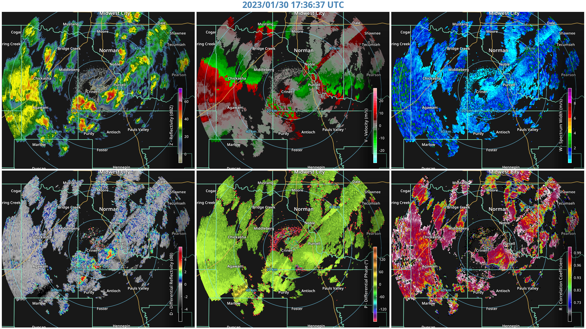

# Python RadarKit Utilities

Some wrapped RadarKit functions and Python utilities for handling data


## RHI Example

The following plot can be produced as:

```python
import radarkit
import radarkit.chart

sweep = radarkit.sweep.Sweep(FILE)

rhi = radarkit.chart.ChartRHI()
rhi.set_data(sweep)
```


## PPI Example
```python
import radarkit
import radarkit.chart

sweep = radarkit.sweep.Sweep(FILE)

ppi = radarkit.chart.ChartPPI((1920, 1080), titlecolor="skyblue")
ppi.set_data(sweep)
```

